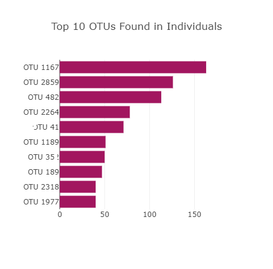
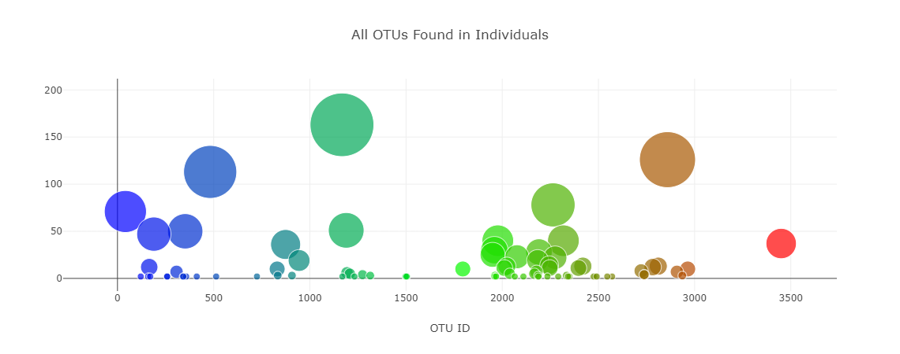
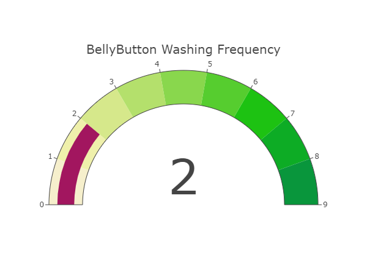

<!-- PROJECT LOGO -->
 

  

<h3 align="center">belly-button-challenge</h3>

  

    Latitude
     
    <a href="https://github.com/joshmartin33/belly-button-challenge" target="_blank"><strong>Explore the docs »</strong></a>
     
     
    <a href="https://joshmartin33.github.io/belly-button-challenge/" target="_blank">View Github pages</a>
    ·
    <a href="https://github.com/joshmartin33/belly-button-challenge/issues">Report Bug</a>
  

<!-- TABLE OF CONTENTS -->

  
Table of Contents

  <ol>
    <li><a href="#about-the-project">About The Project</a></li>
    <li><a href="#setup">Setup</a></li>
    <li><a href="#outcomes">Outcomes</a></li>
        <ul style="list-style-type:square;">
            <li><a href="#bar-chart">Bar Chart</a></li>
            <li><a href="#bubble-chart">Bubble Chart</a></li>
            <li><a href="#gauge-chart">Gauge Chart</a></li>
        </ul>
    <li><a href="#creators">Creators</a></li>
    <li><a href="#citing-and-referencing">Citing and Referencing</a></li>
  </ol>

<!-- ABOUT THE PROJECT -->
## About The Project

In this project, I have built an interactive dashboard to explore the Belly Button Biodiversity found <a href="http://robdunnlab.com/projects/belly-button-biodiversity/">here</a>, which catalogues the microbes that colonise human navels.

The dataset reveals that a small handful of microbial species (also called operational taxonomic units, or OTUs, in the study) were present in more than 70% of people, while the rest were relatively rare.

(<a href="#readme-top">back to top</a>)

<!-- setup -->
## Setup
 
To get a your own copy up and running follow these example steps.
  
<ul>

<li> Download GitHub repository files</li>
<a href= "https://github.com/joshmartin33/belly-button-challenge/archive/refs/heads/main.zip">Download Zip files</a>

<li>Create a new repository.</li>
<li>Clone the new repository to your computer.</li>
<li>Inside your local git repository, copy the files from in the GitHub downloaded files.</li>
<li>Push the above changes to GitHub.</li>
<li>Deploy the new repository to GitHub Pages.</li>
</ul>

(<a href="#readme-top">back to top</a>)

<!-- outcomes -->
## Outcomes
 

<!-- bar chart -->
### Bar Chart
 
Horizontal bar chart to display the top 10 OTUs found in that individual.
 

 

<!-- bubble chart -->
### Bubble Chart
 
Bubble chart that displays each sample.
 

 

<!-- gauge chart -->
### Gauge Chart
 
Gauge Chart to display the weekly washing frequency of the individual.
 

 

(<a href="#readme-top">back to top</a>)

<!-- Creators -->
## Creators

Josh Martin - <a href="https://github.com/joshmartin33">GitHub</a>

(<a href="#readme-top">back to top</a>)

<!-- Citing and Referencing -->
## Citing and Referencing

* Hulcr, J. et al. (2012) A Jungle in There: Bacteria in Belly Buttons are Highly Diverse, but Predictable. Retrieved from: <a href=" http://robdunnlab.com/projects/belly-button-biodiversity/results-and-data/">Link</a>

(<a href="#readme-top">back to top</a>)
